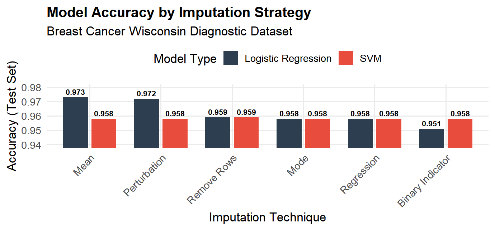

## Data-Imputation
Comparison of data imputation methods for SVM and LR models

I evaluated two different classification algorithms across six imputation methods. 

**Key Finding:** While the **SVM** maintained a consistent baseline regardless of the imputation method, **Logistic Regression** showed higher peak performance (97.3%) when utilizing simple Mean Imputation, suggesting a strong linear relationship in the central tendency of the missing features.
